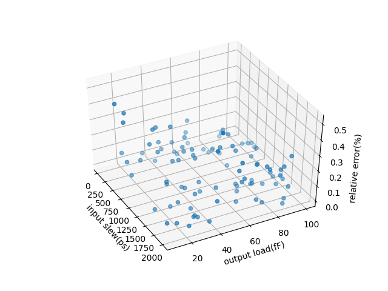

# lutxt
lutxt is a plaint lookup table format for standard cell characterization

# Format explaination
First line always donates the shape of lookup table. From the second line to the end donates the scope of lookup table 

The meaning of each column:
|      column 1  | column 2 | column 3 | column 4 |column 5 | column 6 |
|:-------|:------|:-------|:-------|:-------|:-------|
|  input slew | output load |delay(mean)|delay(stddev)|output_slew(mean)|output_slew(stddev)|

> Time unit:s  Capacitance unit:F

# load_lutxt module
The load_lutxt module is used to load given .lutxt(s) and finish their interpolation by linear interpolation. You can look up their delay and output slew and their variation by give input slew, output capacitance and buffer type. The 7x7 lutxt's relative delay error is under 0.5% with our evaluation by hspice.



# How to load_lutxt

```python3
import load_lutxt as load

Lut = load.LUT("path/to/lutxts") # or Lut = load.LUT("path/to/lutxts/folder")
delay_miu_lut,delay_sigma_lut,slew_miu_lut,slew_sigma_lut = Lut.getAll(slew,cap,0) # 0 corresponding to the 0th *.lutxt file in last step

```
